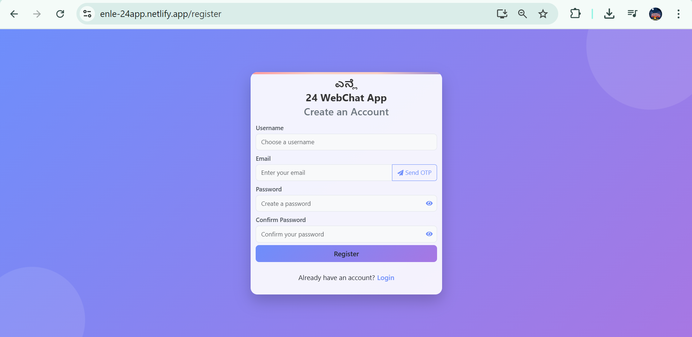
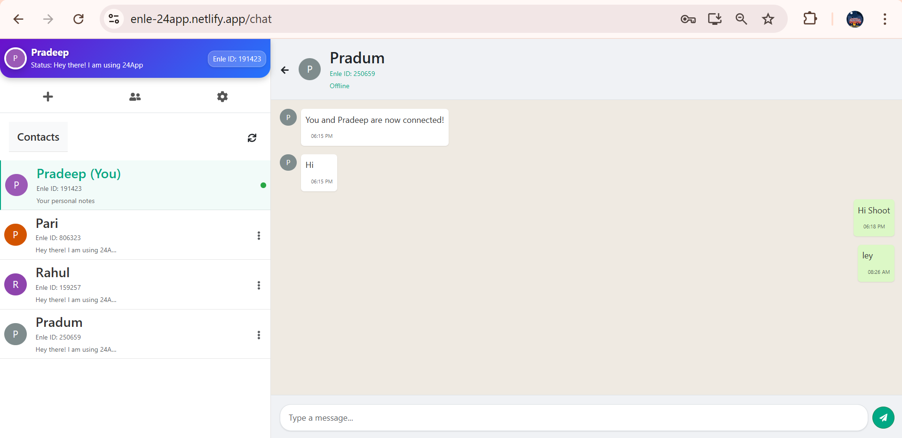
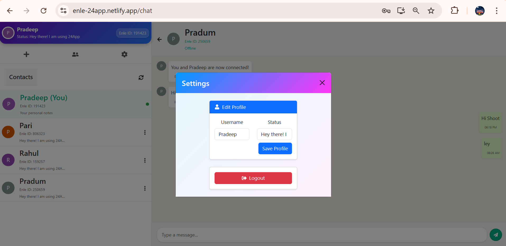
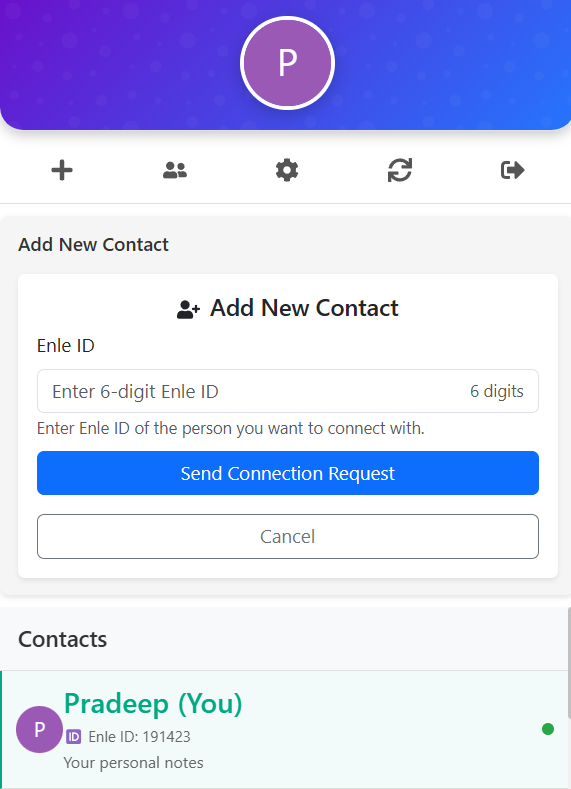

# Enle Webapp 🌐
## 🔗 Live

Check out the live demo [here](https://enle-24app.netlify.app)!

## 🛠️ MERN Stack

- **Frontend:** React.js
- **Backend:** Node.js, Express.js
- **Database:** MongoDB
- **Deployment:** Netlify

## 🌟 Features

- **Interactive UI:** Modern and responsive design for a seamless user experience.
- **Full-Stack Integration:** Utilizes the power of MERN stack for efficient and scalable development.
- **Made in Karnataka:** Proudly developed in the heart of innovation.

## 📸 Live Images

--------------------------------------------------------------------------------------------------------------------------------------------------------

--------------------------------------------------------------------------------------------------------------------------------------------------------

--------------------------------------------------------------------------------------------------------------------------------------------------------

## 🏆 Inspiration

Just like RCB'ians say every year, **#ESCN🏆** – Never lose hope! This project is a reminder to keep pushing forward, no matter the challenges.

## 👨‍💻 Made by Me

This project is a result of my passion for coding and innovation. Feel free to connect with me:

- [Email](mailto:pradeepbangari24@gmail.com) - [LinkedIn](https://www.linkedin.com/in/pradeep-bangari24/)

## 🤝 Contributing

Contributions are welcome! If you'd like to contribute, please fork the repository and submit a pull request.

## 📜 License

This project is licensed under the MIT License. See the [LICENSE](LICENSE) file for details.
